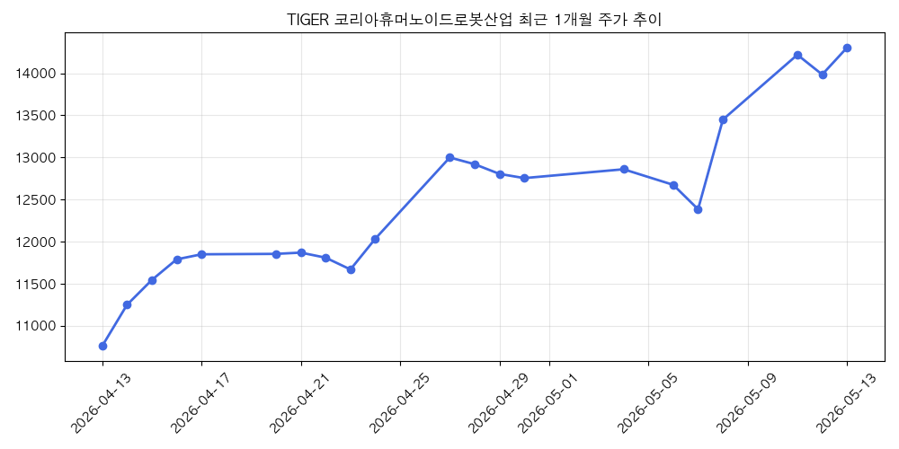

## TIGER 미국S&P500 (360750) 시리즈 제 1편: S&P 500 지수의 현재 위치와 투자 전략

**서론**

본 보고서는 'TIGER 미국S&P500 (360750)' ETF 시리즈의 첫 번째 편으로서, 투자자들이 S&P 500 지수의 현재 시장 환경을 이해하고 합리적인 투자 결정을 내릴 수 있도록 전문적인 분석을 제공하고자 합니다. S&P 500 지수는 미국 대표 500개 상장 기업을 포함하는 주가지수로, 미국 경제 및 글로벌 증시의 흐름을 파악하는 데 핵심적인 지표 역할을 합니다. 본 보고서에서는 S&P 500 지수의 최근 추세, 주요 동인, 그리고 'TIGER 미국S&P500 (360750)' ETF를 활용한 투자 전략에 대해 심층적으로 논의할 것입니다.

**S&P 500 지수의 최근 동향 분석**

최근 S&P 500 지수는 거시 경제 변수와 기업 실적이라는 두 가지 주요 동인에 의해 상당한 변동성을 경험하고 있습니다. 금리 인상 기조, 인플레이션 압력, 지정학적 불확실성 등은 시장 전반에 걸쳐 불안감을 조성하며 투자 심리를 위축시키기도 했습니다. 그러나 동시에 미국 경제의 견조한 회복력, 기업들의 강력한 이익 성장, 그리고 기술 섹터를 중심으로 한 혁신적인 성장 동력은 지수 하락을 방어하고 상승 모멘텀을 구축하는 데 기여하고 있습니다.

상기 차트는 S&P 500 지수의 최근 1년간 추세를 시각적으로 보여줍니다. 보시는 바와 같이, 지수는 여러 차례의 조정과 반등을 반복하며 방향성을 탐색하고 있습니다. 특정 기간 동안에는 거시 경제적 악재에 민감하게 반응하며 하락세를 보였으나, 긍정적인 기업 실적 발표와 경기 부양책에 대한 기대로 회복세를 보이기도 했습니다. 현재 지수의 위치는 과거 평균 대비 높은 수준을 유지하고 있으나, 향후 상승 여력과 잠재적 위험 요인을 면밀히 평가해야 할 시점입니다.

**지수 변동성의 주요 동인**

S&P 500 지수의 변동성은 복합적인 요인에 의해 결정됩니다.

1.  **통화 정책:** 미국 연방준비제도(Fed)의 금리 인상 및 긴축 정책은 시장 유동성을 축소시키고 기업의 자금 조달 비용을 증가시켜 증시에 하방 압력을 가합니다. 반대로, 금리 인하 기대감은 시장에 긍정적인 영향을 미칠 수 있습니다.
2.  **인플레이션:** 지속적인 인플레이션은 소비자의 구매력을 약화시키고 기업의 생산 비용을 상승시켜 수익성을 저해할 수 있습니다. 인플레이션 둔화 신호는 시장에 안도감을 제공할 가능성이 높습니다.
3.  **기업 실적:** S&P 500 구성 기업들의 분기별 실적 발표는 주가에 직접적인 영향을 미칩니다. 예상치를 상회하는 이익은 주가 상승을 견인하며, 기대치에 미치지 못하는 실적은 하락 압력을 가중시킵니다.
4.  **거시 경제 지표:** GDP 성장률, 실업률, 소비자 신뢰 지수 등 주요 경제 지표는 미국 경제의 건전성을 보여주며, 이는 S&P 500 지수의 방향성에 중요한 영향을 미칩니다.
5.  **지정학적 리스크:** 전쟁, 무역 분쟁 등 예측 불가능한 지정학적 사건은 글로벌 공급망을 교란하고 투자 심리를 악화시켜 시장의 불확실성을 증대시킵니다.

**'TIGER 미국S&P500 (360750)' ETF 투자 전략**

'TIGER 미국S&P500 (360750)' ETF는 S&P 500 지수의 성과를 추종하는 대표적인 상장지수펀드로서, 개별 주식 투자 대비 분산 투자 효과를 제공하며, 미국 시장에 간편하게 투자할 수 있는 매력적인 수단입니다.

현재 시장 환경을 고려할 때, 다음과 같은 투자 전략을 제안합니다.

*   **장기 투자 관점 유지:** S&P 500 지수는 역사적으로 장기적으로 우상향하는 추세를 보여왔습니다. 단기적인 시장 변동성에 일희일비하기보다는, 장기적인 안목으로 투자하는 것이 중요합니다.
*   **분할 매수 활용:** 시장의 고점 논란이 제기될 수 있는 시점에서는, 일시적인 자금 투입보다는 분할 매수를 통해 매입 단가를 낮추고 시장의 변동성을 완화하는 전략이 유효합니다.
*   **포트폴리오 다각화:** 'TIGER 미국S&P500 (360750)' ETF 외에도 다른 자산군(채권, 원자재 등) 또는 다른 지역의 주식 시장 ETF를 함께 고려하여 포트폴리오를 다각화함으로써 위험을 분산하는 것이 권장됩니다.
*   **정기적인 리밸런싱:** 시장 상황 변화에 따라 포트폴리오 내 자산 비중을 주기적으로 점검하고 조정하는 리밸런싱을 통해 투자 목표를 유지하고 리스크를 관리해야 합니다.

**결론**

'TIGER 미국S&P500 (360750)' ETF는 미국 대표 기업에 투자하고자 하는 투자자들에게 매력적인 선택지입니다. 현재 S&P 500 지수는 다양한 거시 경제적 요인과 기업 실적에 의해 영향을 받으며 변동성을 보이고 있습니다. 투자자들은 이러한 시장 환경을 면밀히 분석하고, 장기적인 관점, 분할 매수, 포트폴리오 다각화, 그리고 정기적인 리밸런싱 등의 전략을 통해 'TIGER 미국S&P500 (360750)' ETF를 현명하게 활용하여 투자 목표를 달성해 나가시기를 바랍니다.

다음 편에서는 'TIGER 미국S&P500 (360750)' ETF의 구체적인 투자 특징과 운용 전략에 대해 더욱 상세하게 다룰 예정입니다.